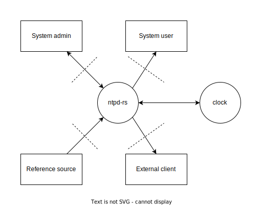

# Threat Model ntpd-rs

This document a threat model, based on the methodology presented by Eleanor Saitta, that we as developers use as a guide in our development process. It may not contain all the context needed to fully understand it, if clarifications are needed please ask us.

## Actors, Assets & Actions

### Actors

We model the following actors:
 - System Admin: Administrator of the system running ntpd-rs
 - System User: Non-administrator user of the system running ntpd-rs
 - Reference Source: A remote time server we use as a source for our time.
 - External Client: A remote user that is allowed to use this instance of ntpd-rs to receive time.
 - Anonymous: Any other party

### Assets

We model the following assets:
 - Clock: The system clock
 - Source configuration: The configuration on which sources to use, including some metadata on the current status of those sources
 - Server configuration: The configuration on which interfaces to provide an NTP server on, and who can use those, including some metadata on the current server status.

### Actions

<table>
    <tr>
        <th></th>
        <th colspan=2>Clock</th>
        <th colspan=2>Source Configuration</th>
        <th colspan=2>Server Configuration</th>
    </tr>
    <tr>
        <th rowspan=2>System admin</th>
        <td>Create - N/A</td>
        <td bgcolor="green">Read - Always</td>
        <td bgcolor="green">Create - Always</td>
        <td bgcolor="green">Read - Always</td>
        <td bgcolor="green">Create - Always</td>
        <td bgcolor="green">Read - Always</td>
    </tr>
    <tr>
        <td bgcolor="green">Update - Always</td>
        <td>Delete - N/A</td>
        <td bgcolor="green">Update - Always</td>
        <td>Delete - N/A</td>
        <td bgcolor="green">Update - Always</td>
        <td>Delete - N/A</td>
    </tr>
    <tr>
        <th rowspan=2>System user</th>
        <td>Create - N/A</td>
        <td bgcolor="green">Read - Always</td>
        <td bgcolor="red">Create - Never</td>
        <td bgcolor="orange">Read - Sometimes</td>
        <td bgcolor="red">Create - Never</td>
        <td bgcolor="orange">Read - Sometimes</td>
    </tr>
    <tr>
        <td bgcolor="red">Update - Never</td>
        <td>Delete - N/A</td>
        <td bgcolor="red">Update - Never</td>
        <td>Delete - N/A</td>
        <td bgcolor="red">Update - Never</td>
        <td>Delete - N/A</td>
    </tr>
    <tr>
        <th rowspan=2>Reference source</th>
        <td>Create - N/A</td>
        <td bgcolor="red">Read - Never</td>
        <td bgcolor="red">Create - Never</td>
        <td bgcolor="red">Read - Never</td>
        <td bgcolor="red">Create - Never</td>
        <td bgcolor="red">Read - Never</td>
    </tr>
    <tr>
        <td bgcolor="orange">Update - Sometimes</td>
        <td>Delete - N/A</td>
        <td bgcolor="red">Update - Never</td>
        <td>Delete - N/A</td>
        <td bgcolor="red">Update - Never</td>
        <td>Delete - N/A</td>
    </tr>
    <tr>
        <th rowspan=2>External client</th>
        <td>Create - N/A</td>
        <td bgcolor="green">Read - Always</td>
        <td bgcolor="red">Create - Never</td>
        <td bgcolor="green">Read - Always</td>
        <td bgcolor="red">Create - Never</td>
        <td bgcolor="red">Read - Never</td>
    </tr>
    <tr>
        <td bgcolor="red">Update - Never</td>
        <td>Delete - N/A</td>
        <td bgcolor="red">Update - Never</td>
        <td>Delete - N/A</td>
        <td bgcolor="red">Update - Never</td>
        <td>Delete - N/A</td>
    </tr>
    <tr>
        <th rowspan=2>Anonymous</th>
        <td>Create - N/A</td>
        <td bgcolor="red">Read - Never</td>
        <td bgcolor="red">Create - Never</td>
        <td bgcolor="red">Read - Never</td>
        <td bgcolor="red">Create - Never</td>
        <td bgcolor="red">Read - Never</td>
    </tr>
    <tr>
        <td bgcolor="red">Update - Never</td>
        <td>Delete - N/A</td>
        <td bgcolor="red">Update - Never</td>
        <td>Delete - N/A</td>
        <td bgcolor="red">Update - Never</td>
        <td>Delete - N/A</td>
    </tr>
</table>

 - Reference sources may update the Clock only when sufficiently many agree and don't exceed configured adjustment limits.
 - System users may read configuration (both types) only when allowed by system admin.

## Failure cases

<table>
    <tr>
        <th></th>
        <th colspan=2>Escalation of Privilege</th>
        <th colspan=2>Denial of Service</th>
    </tr>
    <tr>
        <th rowspan=2>Clock</th>
        <td>Create - NA</td>
        <td bgcolor="green">Read - Low</td>
        <td>Create - NA</td>
        <td bgcolor="yellow">Read - Medium</td>
    </tr>
    <tr>
        <td bgcolor="red">Update - Critical</td>
        <td>Delete - N/A</td>
        <td bgcolor="yellow">Update - Medium</td>
        <td>Delete - N/A</td>
    </tr>
    <tr>
        <th rowspan=2>Source configuration</th>
        <td bgcolor="red">Create - Critical</td>
        <td bgcolor="yellow">Read - Medium</td>
        <td>Create - N/A</td>
        <td bgcolor="green">Read - Low</td>
    </tr>
    <tr>
        <td bgcolor="red">Update - Critical</td>
        <td>Delete - N/A</td>
        <td bgcolor="green">Update - Low</td>
        <td>Delete - N/A</td>
    </tr>
    <tr>
        <th rowspan=2>Server configuration</th>
        <td bgcolor="yellow">Create - Medium</td>
        <td bgcolor="green">Read - Low</td>
        <td>Create - N/A</td>
        <td bgcolor="green">Read - Low</td>
    </tr>
    <tr>
        <td bgcolor="yellow">Update - Medium</td>
        <td>Delete - N/A</td>
        <td bgcolor="green">Update - Low</td>
        <td>Delete - N/A</td>
    </tr>
</table>

## Security strategy

 - If any actor tries to read the clock, the system will not respond with a valid time if the IP address is not on the configured allowlist
 - If any actor tries to update the clock, the system tries to verify consensus among multiple reference sources
 - If any actor tries to update the clock, the system refuses updates beyond a configured limit
 - If the configuration file (used to create the configuration) is world-writable, the system will emit a warning
 - If the configuration socket (used to update the configuration) is world-writable, the system will emit a warning
 - The observability socket (used to read the configuration/status) is a unix socket, which is unreachable over the network by default
 - If any actor tries to read the clock too often, the system will stop responding a valid time to them

## Data flow diagram

 - The security boundaries between the admin and system users and ntpd-rs run through the unix sockets used for communication.
 - The security boundaries for reference sources and external clients run through the network sockets used for communication.
