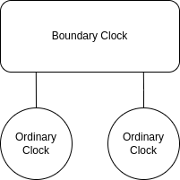

# Setting up a simple PTP network

This example network configuration consists of two ordinary clocks, connected to each other through a boundary clock,
all of which are running on Linux:



It should be relatively straightforward to extrapolate for more complicated networks.

## Ordinary Clocks

To get PTP up and running for each of the ordinary clocks, install `statime-linux` on both of them:

```shell
cargo install --git https://github.com/pendulum-project/statime.git --rev 52b17e3 --bin statime-linux
```

`statime-linux` contains a CLI binary that can be used to start ordinary clock instances:

```shell
# use ifconfig to find the descriptor corresponding to the interface connected to the boundary clock
ifconfig
statime-linux --interface enp1s0f1
```

Ordinary clocks can also be configured through code. Doing so is very similar to configuring boundary clocks, which is
explained in the next section.

## Boundary Clock

Setting up a boundary clock is currently only possible through code. Start by creating a new Rust project:

```shell
cargo new boundary_clock
cd boundary_clock
```

In `Cargo.toml`, add the following dependencies:

```toml
[package]
name = "test-bc"
version = "0.1.0"
edition = "2021"

# See more keys and their definitions at https://doc.rust-lang.org/cargo/reference/manifest.html

[dependencies]
clap = { version = "3.1.6", features = ["derive"] }
log = "0.4.14"
env_logger = "0.10.0"
statime = { git = "https://github.com/pendulum-project/statime.git", rev = "52b17e3" }
statime-linux = { git = "https://github.com/pendulum-project/statime.git", rev = "52b17e3" }
tokio = { version = "1.27", features = ["full"] }
```

Then, in `src/main.rs`, add the following code:

```rust
use std::env;

use statime::{
    datastructures::{
        common::{ClockIdentity, PortIdentity, TimeSource},
        datasets::{DefaultDS, DelayMechanism, PortDS, TimePropertiesDS},
        messages::SdoId,
    },
    filters::basic::BasicFilter,
    port::Port,
    ptp_instance::PtpInstance,
};
use statime_linux::{
    clock::{LinuxClock, LinuxTimer, RawLinuxClock},
    network::linux::{get_clock_id, LinuxRuntime},
};

#[tokio::main]
async fn main() {
    env_logger::init();

    let local_clock = LinuxClock::new(RawLinuxClock::get_realtime_clock());
    let mut network_runtime = LinuxRuntime::new(false, &local_clock);
    let clock_identity = ClockIdentity(get_clock_id().expect("Could not get clock identity"));

    let default_ds =
        DefaultDS::new_boundary_clock(clock_identity, 2, 128, 128, 0, SdoId::default());

    let time_properties_ds =
        TimePropertiesDS::new_arbitrary_time(false, false, TimeSource::InternalOscillator);

    let port_1_ds = PortDS::new(
        PortIdentity {
            clock_identity,
            port_number: 1,
        },
        1,
        1,
        3,
        0,
        DelayMechanism::E2E,
        1,
    );
    let interface = env::var("PORT1")
        .expect("PORT1 interface descriptor not set")
        .parse()
        .expect("invalid interface descriptor for PORT1");
    let port_1 = Port::new(port_1_ds, &mut network_runtime, interface).await;

    let port_2_ds = PortDS::new(
        PortIdentity {
            clock_identity,
            port_number: 2,
        },
        1,
        1,
        3,
        0,
        DelayMechanism::E2E,
        1,
    );
    let interface = env::var("PORT2")
        .expect("PORT2 interface descriptor not set")
        .parse()
        .expect("invalid interface descriptor for PORT2");
    let port_2 = Port::new(port_2_ds, &mut network_runtime, interface).await;

    let mut instance = PtpInstance::new_boundary_clock(
        default_ds,
        time_properties_ds,
        [port_1, port_2],
        local_clock,
        BasicFilter::new(0.25),
    );

    instance.run(&LinuxTimer).await;
}
```

This configures two PTP ports, binds them to interfaces described by the environment variables `PORT1` and `PORT2`, and
starts a boundary clock PTP instance. To run the binary, execute the following commands:

```shell
# use ifconfig to find the descriptors corresponding to the interfaces connected to the ordinary clocks
ifconfig
PORT1=enp1s0f0 PORT2=enp1s0f1 cargo run
```
